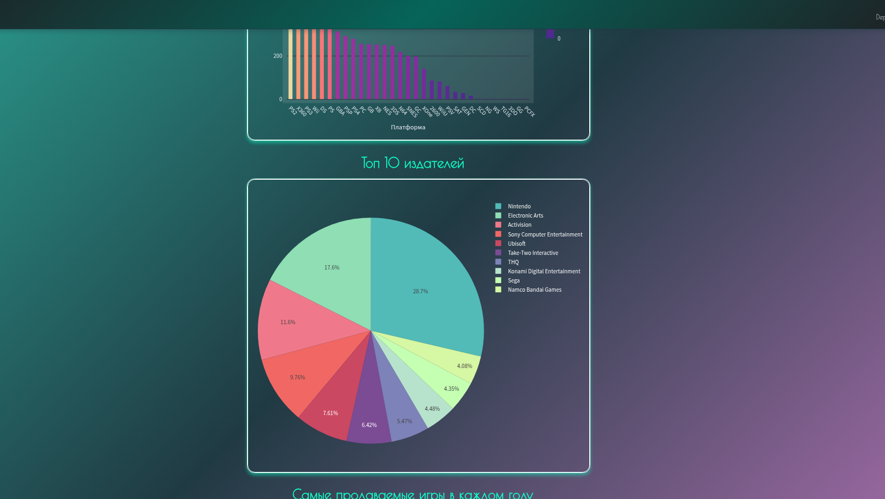

# 👾 Анализ продаж видеоигр

## Приложение [здесь](https://video-games-sales-analysis-dashboard-yhdgjyrhnncv75rsbtsuen.streamlit.app/)

Небольшой дашборд, собранный на:
- pandas
- streamlit
- plotly

## Графики (app.py): 
 - #### Продажи по платформам
 - #### Топ 10 издателей по количеству продаж
 - #### Самые продаваемые игры в каждом году
 - #### Самые продаваемые игры по регионам 
 - #### Топ 10 самых продаваемых игр по регионам
 - #### Топ 10 самых продаваемых игр по жанрам
 - #### Популярность жанров по годам

## Что куда и зачем
- **app.py** - основное приложение на streamlit, с графиками на plotly
- **notebook.ipynb** - Jupyter Notebook с чисткой данных, их извлечением
- **requirements.txt** - необходимые для установки компаненты

Установка:

```bash
pip install -r requirements.txt
```

---

- **data/**- папка со всеми .csv файлами
- **.streamlit/** - папка с кастомными стилями для streamlit
- **assets/** - ресурсы, картинки

## Превью дашборда



## Ресурсы
Использованный датасет:  https://www.kaggle.com/code/upadorprofzs/eda-video-game-sales
